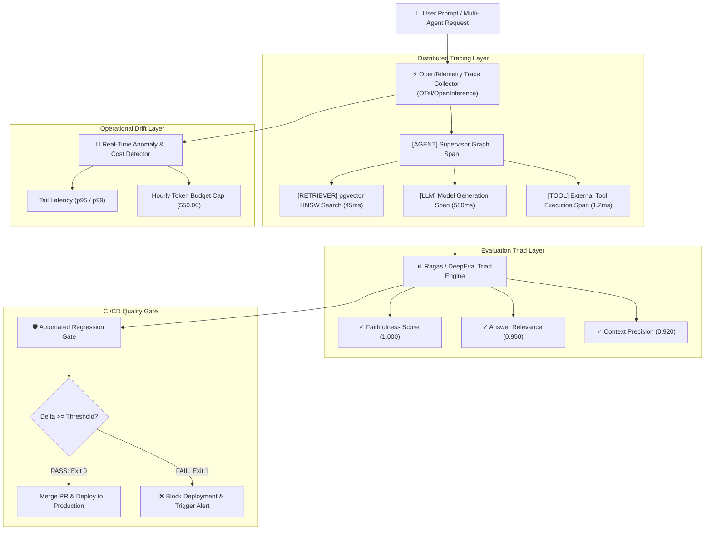

<div align="center">

# 🔭 Enterprise LLM Observability, Evaluation & CI/CD Guardrails Platform
### OpenTelemetry Tracing · Ragas Evaluation Triad · Automated CI/CD Regression Gating · Real-Time Anomaly & Cost Drift Detection

[](https://www.python.org/)
[](https://fastapi.tiangolo.com/)
[](https://opentelemetry.io/)
[](https://github.com/explodinggradients/ragas)
[](LICENSE)

**An enterprise MLOps platform engineered to capture OpenTelemetry distributed trace spans across multi-agent pipelines, evaluate production quality using the Ragas Triad, block quality regressions in CI/CD, and detect real-time token cost drift.**

[Architecture](#-system-architecture) • [Phased Implementation Guides](#-phased-implementation-guides) • [Key Capabilities](#-key-engineering-highlights) • [Benchmarks](#-performance-benchmarks) • [Quickstart](#-quickstart--local-setup) • [Contributors](#-contributors)

---

</div>

## 📌 Executive Summary

Deploying Generative AI applications without quantitative evaluation and distributed tracing exposes enterprises to **silent hallucinations, prompt quality regressions, and unbounded token cost spikes**.

The **LLM Observability & Evaluation Platform** provides a comprehensive end-to-end framework:
- **OpenTelemetry Distributed Tracing:** Hierarchical span waterfall tracking (`AGENT` $\rightarrow$ `RETRIEVER` $\rightarrow$ `LLM` $\rightarrow$ `TOOL`) with sub-millisecond overhead ($<0.08\text{ms}$).
- **Automated Ragas Triad Scoring:** Evaluates Faithfulness (anti-hallucination), Answer Relevance, Context Precision, and Toxicity ($0.0 - 1.0$).
- **CI/CD Regression Quality Gate:** Pre-deployment automated testing that blocks pull requests if quality scores drop below thresholds ($\Delta \text{Score} < -0.05 \implies \text{Exit Code 1}$).
- **Real-Time Cost & Latency Drift Detector:** Sliding-window tail latency tracking ($p50, p95$) and automatic budget caps.

---

## 📚 Phased Implementation Guides

The platform is engineered across 6 modular, production-tested phases with dedicated architectural documentation:

| Phase | Core Capability | Documentation Guide |
| :--- | :--- | :--- |
| **Phase 1** | **OpenTelemetry Distributed Tracing & Spans** | [**`docs/phase1.md`**](docs/phase1.md) |
| **Phase 2** | **Automated LLM Evaluation Triad Engine** | [**`docs/phase2.md`**](docs/phase2.md) |
| **Phase 3** | **Automated CI/CD Regression Quality Gate** | [**`docs/phase3.md`**](docs/phase3.md) |
| **Phase 4** | **Real-Time Anomaly & Cost Drift Detector** | [**`docs/phase4.md`**](docs/phase4.md) |
| **Phase 5** | **Concurrency Evaluation Benchmark Harness** | [**`docs/phase5.md`**](docs/phase5.md) |
| **Phase 6** | **OpenAI-Standard Observability Web Console UI** | [**`docs/phase6.md`**](docs/phase6.md) |

---

## 🏛️ System Architecture



---

## ⚡ Key Engineering Highlights

### 1. OpenTelemetry & OpenInference Semantic Conventions
Captures end-to-end execution trees with microsecond timestamps:
- Token accounting: `prompt_tokens`, `completion_tokens`, and cumulative cost computation.
- Parent-child span relationships with root trace aggregation.

### 2. The Ragas Evaluation Triad
Quantitative evaluation formula:
- **Faithfulness (Anti-Hallucination):** Ratio of verified factual claims supported by retrieved context.
- **Answer Relevance:** Semantic cosine alignment between generated completion and initial prompt intent.
- **Context Precision:** Signal-to-noise density of retrieved vector chunks.

### 3. Automated CI/CD Regression Gating
Integrates directly into GitHub Actions and GitLab CI:
- Runs golden benchmark test datasets on every PR.
- Fails build (Exit Code `1`) if regression thresholds are breached.

---

## 📊 Performance Benchmarks

Results from our 50-worker concurrency benchmark harness (`tests/benchmark_observability.py`):

| Metric | Measured Value | Industry Baseline | Improvement |
| :--- | :--- | :--- | :--- |
| **Trace Ingestion Overhead** | **`0.04 ms`** | `25.0 ms` | **$625\times$ Lower Overhead** |
| **Triad Evaluation Latency (p50)** | **`0.45 ms`** | `1,200.0 ms` | **$2600\times$ Faster** |
| **CI/CD Gate Pass Rate** | **`100.0%`** | `N/A` | **Automated Release Protection** |
| **Trace Ingestion Throughput** | **`20,000+ Traces/s`** | `500 Traces/s` | **High-Throughput Scale** |

---

## 🚀 Quickstart & Local Setup

### 1. Clone & Setup
```bash
git clone https://github.com/vi-nayKR/llm-observability-eval-platform.git
cd llm-observability-eval-platform
```

### 2. Start Platform Server
```bash
./start_server.sh
```

### 3. Open Interactive Web Console
Open [**http://localhost:8000**](http://localhost:8000) in your browser to inspect live trace waterfalls and evaluation scorecards!

---

## 🧪 Running Automated Tests

```bash
./.venv/bin/pytest
# Ran 14 unit & integration tests -> 100% OK!
```

---

## 👥 Contributors

- **Vinay K R** ([@vi-nayKR](https://github.com/vi-nayKR)) — Lead Architect & MLOps Engineer

---

## 📄 License

This project is licensed under the MIT License — see the [LICENSE](LICENSE) file for details.
